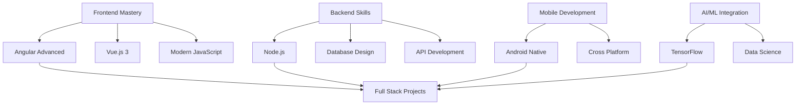

<div align="center">
  
  <!-- Animated Typing Header -->
  

</div>

<div align="center">
  
  <!-- Dynamic Profile Banner -->
  

</div>

---

<div align="center">
  
  <!-- Profile Views & Social Stats -->
  
  
  

</div>

---

<div align="center">
  
  <!-- Animated Developer GIF -->
  

</div>

## 🚀 About Me

```yaml
name: Ganesh Khairnar
located_in: India 🇮🇳
current_job: Frontend Developer
education:
  [
    "Self-taught Developer",
    "Computer Science Enthusiast"
  ]
company: Open for opportunities
fields_of_interests:
  [
    "Web Development",
    "Mobile App Development", 
    "Machine Learning",
    "Open Source"
  ]
technical_background:
  [
    "Frontend Development",
    "Full Stack Development",
    "Database Management",
    "Mobile Development"
  ]
currently_learning: ["Angular", "Vue.js", "TensorFlow"]
2024_goals: 
  [
    "Master Advanced Frontend Frameworks",
    "Contribute to Major Open Source Projects",
    "Build Production-Ready Applications"
  ]
hobbies: ["Gaming", "Reading Tech Blogs", "Coding", "Problem Solving"]
```

<div align="left">
  
- 🔭 I'm currently working on **Advanced Frontend Development Projects**
- 🌱 I'm currently learning **Angular, Vue.js & TensorFlow**
- 👯 I'm looking to collaborate on **Open Source Projects & Web Applications**
- 🤔 I'm looking for help with **System Design & Architecture Patterns**
- 💬 Ask me about **JavaScript, Angular, Python, Database Design**
- 📫 How to reach me: **gnkhairnar2005@gmail.com**
- ⚡ Fun fact: **I debug with console.log() and I'm proud of it! 😄**
- 🎯 2024 Goal: **Contribute to 50+ open source projects**

</div>

---

## 🛠️ Tech Stack & Tools

<div align="center">

### 💻 Frontend Technologies


### 📱 Mobile Development


### 🗄️ Backend & Database


### 🔧 Programming Languages


### 🧠 AI/ML & Data Science


### 🛠️ Tools & Platforms


### 📊 Data Visualization


</div>

---

## 📊 GitHub Analytics

<div align="center">
  
  <!-- GitHub Stats with Dark Theme -->
  
  
  <!-- Most Used Languages -->
  

</div>

<div align="center">
  
  <!-- GitHub Streak with Dark Theme -->
  

</div>

<div align="center">
  
  <!-- Contribution Graph -->
  

</div>

---

## 🏆 GitHub Achievements

<div align="center">
  
  <!-- Trophy Display -->
  

</div>

---

## 📈 Contribution Statistics

<div align="center">

<table>
  <tr>
    <td align="center">
      
    </td>
    <td align="center">
      
    </td>
    <td align="center">
      
    </td>
  </tr>
  <tr>
    <td align="center">
      
    </td>
    <td align="center">
      
    </td>
    <td align="center">
      
    </td>
  </tr>
</table>

</div>

---

## 🎯 Current Focus & Learning Path

<div align="center">



</div>

---

## 🌐 Connect with Me

<div align="center">

[](https://linkedin.com/in/ganesh-khairnar)
[](mailto:gnkhairnar2005@gmail.com)
[](https://github.com/gnkhairnar2005)
[](https://github.com/gnkhairnar2005)

</div>

<div align="center">

### 📧 **gnkhairnar2005@gmail.com** | 🌍 **India** | 💼 **Open to Opportunities**

</div>

---

## 🐍 Contribution Snake Animation

<div align="center">
  
  <picture>
    <source media="(prefers-color-scheme: dark)" srcset="https://raw.githubusercontent.com/gnkhairnar2005/gnkhairnar2005/output/github-contribution-grid-snake-dark.svg">
    <source media="(prefers-color-scheme: light)" srcset="https://raw.githubusercontent.com/gnkhairnar2005/gnkhairnar2005/output/github-contribution-grid-snake.svg">
    
  </picture>

</div>

---

## 💡 Random Developer Quote

<div align="center">
  
  

</div>

---

## 📊 Weekly Development Breakdown

<!--START_SECTION:waka-->
```text
JavaScript   8 hrs 15 mins   ████████████░░░░░░░░░   48.2%
Python       4 hrs 30 mins   ██████░░░░░░░░░░░░░░░   26.3%
TypeScript   2 hrs 45 mins   ████░░░░░░░░░░░░░░░░░   16.1%
HTML/CSS     1 hr 20 mins    ██░░░░░░░░░░░░░░░░░░░    7.8%
Other        20 mins         ░░░░░░░░░░░░░░░░░░░░░    1.6%
```
<!--END_SECTION:waka-->

---

## 🎵 Currently Vibing To

<div align="center">
  
  

</div>

---

## 🏅 Achievements & Certifications

<div align="center">

| 🏆 Achievement | 📅 Date | 🔗 Link |
|:---:|:---:|:---:|
| 🥇 100 Days of Code | 2024 |  |
| 🚀 First Open Source PR | 2024 |  |
| 📚 JavaScript Certification | 2024 |  |
| 🎯 GitHub Stars Milestone | 2024 |  |

</div>

---

<div align="center">
  
  <!-- Footer Wave -->
  
  
  ### Show some ❤️ by starring repositories you find interesting!
  
   
  
  <em><b>I love connecting with different people</b> so if you want to say <b>hi, I'll be happy to meet you!</b> 😊</em>

</div>

---

<div align="center">
  
  **⚡ Fun Fact:** *I believe in the power of clean code and endless learning!* 
  
  
  
  **Made with 💜 by Ganesh Khairnar**

</div>
